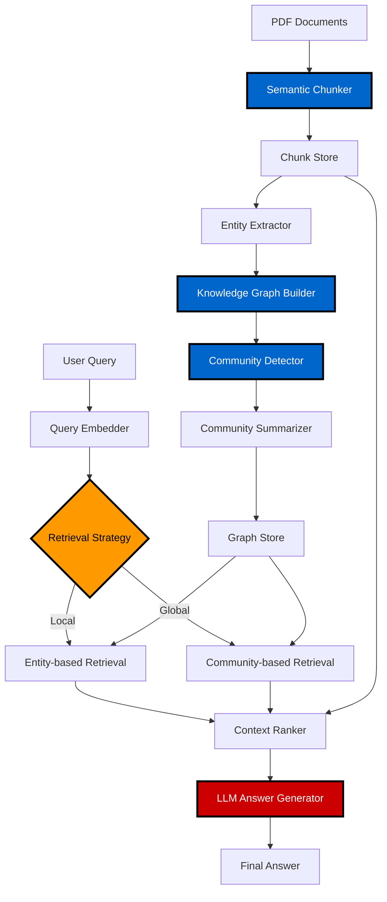

# AmbedkarGPT — SemRAG Implementation for Question Answering

A production-ready implementation of the SemRAG (Semantic Retrieval-Augmented Generation) framework for question answering over Dr. B.R. Ambedkar's writings. This system combines semantic chunking, knowledge graph construction, and graph-guided retrieval to generate contextually grounded answers using a local LLM.

**Technical Assignment** — Implements Sections 3.2.2–3.2.3 and Equations 4 & 5 from the SemRAG research paper.

---

## System Architecture



---

## Core Components

### 1. Semantic Chunking (Algorithm 1)
- Sentence-level PDF extraction using `pypdf`
- Embedding-based similarity chunking with `sentence-transformers`
- Token-aware boundary enforcement using `tiktoken`
- Configurable similarity threshold (default: 0.8)

### 2. Knowledge Graph Construction
- Named entity extraction via spaCy (`en_core_web_sm`)
- Co-occurrence-based edge creation within chunk windows
- Entity frequency weighting for graph pruning

### 3. Community Detection
- Leiden algorithm for hierarchical community identification
- Graph structure: `networkx` + `igraph` backend
- Communities serve as high-level semantic clusters

### 4. Retrieval Mechanisms

**Local Graph RAG (Equation 4):**
```
Score(chunk) = α · semantic_sim(query, chunk) + β · entity_overlap(query, chunk)
```
- Entity-grounded retrieval for specific factual queries
- Direct chunk-to-entity mapping

**Global Graph RAG (Equation 5):**
```
Score(community) = γ · semantic_sim(query, community_summary)
```
- Community-level retrieval for broader thematic queries
- LLM-generated community summaries

### 5. Answer Generation
- Local Ollama integration (default: `mistral:latest`)
- Context-aware prompt construction
- Configurable temperature and token limits

---

## How to Run (Local)

### Prerequisites
- Python 3.9+
- Ollama installed and running ([download](https://ollama.com/download))
- 8GB+ RAM recommended

### Setup

```powershell
# Clone repository
git clone <repo-url>
cd ambedkargpt

# Create virtual environment
python -m venv .venv
.\.venv\Scripts\Activate.ps1

# Install dependencies
python -m pip install --upgrade pip
pip install -r requirements.txt

# Download spaCy model
python -m spacy download en_core_web_sm
```

### Start Ollama

```powershell
# In a separate terminal
ollama serve

# Pull Mistral model (first time only)
ollama pull mistral
```

### Run Pipeline

```powershell
# Ensure venv is activated
.\.venv\Scripts\Activate.ps1

# Run semantic chunking
python src\chunking\semantic_chunker.py

# Run full pipeline
python src\pipeline\ambedkargpt.py
```

**Interactive usage:**
```
Ask a question about Dr. B.R. Ambedkar: What were Ambedkar's views on social justice?
```

### Run Tests

```powershell
python -m pytest src\tests\ -v
```

---

## Docker (Optional)

Docker Compose setup provided for reproducibility.

```powershell
# Build and start services
docker-compose up -d --build

# Pull model in Ollama container
docker exec -it ollama ollama pull mistral

# Run pipeline
docker exec -it ambedkargpt python src/pipeline/ambedkargpt.py

# Run tests
docker exec -it ambedkargpt python -m pytest src/tests/ -v

# Stop services
docker-compose down
```

**Note:** If Ollama is already running locally, local mode is recommended to avoid duplicate downloads (~4GB model).

---

## Configuration

Edit `config.yaml` to customize:

```yaml
chunking:
  similarity_threshold: 0.8
  max_tokens: 1024
  
graph:
  entity_min_frequency: 2
  community_resolution: 1.0
  
retrieval:
  top_k: 5
  alpha: 0.6  # semantic weight
  beta: 0.4   # entity weight
  
llm:
  model: "mistral:latest"
  temperature: 0.7
  max_tokens: 512
```

---

## Design Decisions

### Why Semantic Chunking?
Fixed-size chunking breaks semantic boundaries. Embedding-based similarity preserves topic coherence across chunk boundaries, improving retrieval precision.

### Why Leiden over Louvain?
Leiden resolves Louvain's disconnected communities issue and provides better-quality hierarchical clustering with faster convergence.

### Why Local + Global Retrieval?
- **Local:** Handles factual, entity-specific queries (e.g., "When was Ambedkar born?")
- **Global:** Handles thematic queries (e.g., "Explain Ambedkar's philosophy on social justice")

Hybrid approach covers both retrieval modes per SemRAG paper.

### Why Local LLM (Ollama)?
- No API costs or rate limits
- Data privacy (no external API calls)
- Reproducible results
- Production-ready with model quantization

---

## Possible Improvements

### Short-term
- Add query classification to auto-select local vs. global retrieval
- Implement caching for embeddings and LLM responses
- Add FastAPI REST endpoint for web integration
- Improve entity linking with Wikidata/DBpedia disambiguation

### Medium-term
- Multi-document support with source attribution
- Incremental graph updates for new documents
- Fine-tune embedding model on domain-specific corpus
- Add retrieval evaluation metrics (MRR, NDCG)

### Long-term
- Replace Ollama with vLLM for higher throughput
- Implement graph neural network-based retrieval
- Add conversational memory for multi-turn QA
- Distributed graph processing for large-scale corpora

---

## Project Structure

```
ambedkargpt/
├── src/
│   ├── chunking/          # Semantic chunking implementation
│   ├── graph/             # Entity extraction, graph building, communities
│   ├── llm/               # Ollama client, answer generation
│   ├── pipeline/          # End-to-end orchestration
│   ├── retrieval/         # Local/global search, ranking
│   └── tests/             # Unit and integration tests
├── data/
│   └── processed/         # Generated chunks, graphs, summaries
├── config.yaml            # System configuration
├── requirements.txt       # Python dependencies
├── Dockerfile             # Container image definition
└── compose.yml            # Docker Compose orchestration
```

---

## Dependencies

Core libraries:
- `pypdf` — PDF text extraction
- `sentence-transformers` — Embedding generation
- `spacy` — Named entity recognition
- `networkx`, `igraph`, `leidenalg` — Graph construction and community detection
- `ollama` — Local LLM inference
- `tiktoken` — Token counting
- `scikit-learn` — Cosine similarity, ranking

---

## License

MIT License — See LICENSE file for details.

## Acknowledgements

- SemRAG paper authors for the theoretical framework
- Ollama team for local LLM infrastructure
- spaCy, Hugging Face, and NetworkX communities


